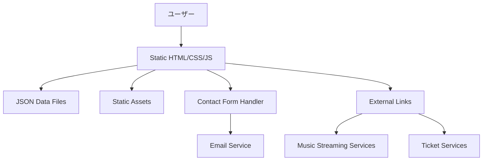

# Design Document

## Overview

AiRiaアーティストサイトは、シンプルなHTML、CSS、JavaScriptを使用した静的ウェブサイトとして設計されます。モダンなCSS機能（Grid、Flexbox、CSS Variables）とバニラJavaScriptを活用し、軽量で高速なサイトを実現します。デザインはモバイルファーストのアプローチを採用し、アーティストの魅力を最大限に伝える視覚的に美しいインターフェースを提供します。

## Architecture

### システム構成



### 技術スタック

- **フロントエンド**: HTML5, CSS3, Vanilla JavaScript (ES6+)
- **スタイリング**: CSS Grid, Flexbox, CSS Variables, CSS Animations
- **コンテンツ管理**: JSON ファイル + JavaScript での動的読み込み
- **画像最適化**: WebP フォーマット + レスポンシブ画像
- **デプロイ**: 静的ホスティング（Netlify, GitHub Pages, Vercel）
- **コンタクト**: LINE公式アカウント統合
- **SNS統合**: 各種SNSプラットフォームへのリンク

## Components and Interfaces

### ページ構成

1. **ホームページ (`/`)**
   - ヒーローセクション（メインビジュアル）
   - 最新ニュース（3件）
   - 次回ライブ情報
   - SNSフィード統合

2. **アーティストページ (`/artist`)**
   - メンバープロフィール（あい・リア）
   - バイオグラフィー
   - フォトギャラリー

3. **音楽ページ (`/music`)**
   - ディスコグラフィー
   - 楽曲プレーヤー
   - ストリーミングサービスリンク

4. **ライブページ (`/live`)**
   - 今後のライブスケジュール
   - 過去のライブアーカイブ
   - ライブフォトギャラリー

5. **ニュースページ (`/news`)**
   - ニュース記事一覧
   - 記事詳細ページ
   - カテゴリー別フィルタリング

6. **コンタクトページ (`/contact`)**
   - 公式LINE友だち追加ボタン
   - SNSリンク
   - 事務所情報

7. **イベント特設ページ (`/events/[slug]`)**
   - 動的ルーティング
   - イベント固有のデザイン
   - チケット情報統合

### コンポーネント設計

```javascript
// JSONデータ構造
const memberData = {
  id: "string",
  name: "string",
  nameEn: "string", 
  bio: "string",
  profileImage: "string",
  socialLinks: [
    { platform: "string", url: "string" }
  ]
};

const songData = {
  id: "string",
  title: "string",
  releaseDate: "string",
  coverArt: "string",
  previewUrl: "string",
  streamingLinks: [
    { platform: "string", url: "string" }
  ]
};

const liveEventData = {
  id: "string",
  title: "string",
  date: "string",
  venue: "string",
  ticketUrl: "string",
  description: "string",
  images: ["string"]
};

const newsArticleData = {
  id: "string",
  title: "string",
  publishDate: "string",
  content: "string",
  featuredImage: "string",
  category: "string"
};
```

### HTMLコンポーネント構造

- **Header**: ナビゲーション、ロゴ、ハンバーガーメニュー
- **Footer**: SNSリンク、コピーライト、サイトマップ
- **Navigation**: CSS/JSによるレスポンシブナビゲーション
- **SEO**: HTMLメタタグ、OGP設定

## Data Models

### コンテンツ管理

```javascript
// JSONファイル構造
// data/content.json
{
  "members": [...],
  "songs": [...],
  "liveEvents": [...],
  "news": [...],
  "siteSettings": {
    "title": "AiRia Official Website",
    "description": "女性ボーカルユニットAiRiaのオフィシャルサイト",
    "socialLinks": [...]
  }
}
```

### コンタクト機能

```javascript
// LINE公式アカウント統合
const lineOfficialAccount = {
  lineId: "@airia_official", // 例
  addFriendUrl: "https://line.me/R/ti/p/@airia_official",
  qrCodeImage: "/images/line-qr-code.png"
};

// SNSリンク管理
const socialLinks = {
  twitter: "https://twitter.com/airia_official",
  instagram: "https://instagram.com/airia_official", 
  youtube: "https://youtube.com/@airia_official",
  tiktok: "https://tiktok.com/@airia_official"
};
```

## Error Handling

### エラー処理戦略

1. **JavaScript エラー**
   - try-catch文による適切なエラーハンドリング
   - ユーザーフレンドリーなエラーメッセージ表示
   - グレースフルデグラデーション

2. **データ読み込みエラー**
   - fetch API のエラーハンドリング
   - ローディング状態の表示
   - フォールバック表示

3. **外部サービス連携エラー**
   - LINE公式アカウントリンクの有効性確認
   - SNSリンクの動作確認
   - 外部サービス障害時のフォールバック表示

```javascript
// エラーハンドリング例
async function loadData(url) {
  try {
    const response = await fetch(url);
    if (!response.ok) {
      throw new Error(`HTTP error! status: ${response.status}`);
    }
    return await response.json();
  } catch (error) {
    console.error('データの読み込みに失敗しました:', error);
    showErrorMessage('データの読み込みに失敗しました。しばらく後でお試しください。');
    return null;
  }
}
```

## Testing Strategy

### テスト階層

1. **Manual Testing**
   - ブラウザでの手動テスト
   - 各ページの機能確認
   - レスポンシブデザインの確認

2. **JavaScript Function Tests**
   - ユーティリティ関数の動作確認
   - フォームバリデーションのテスト
   - データ処理関数のテスト

3. **Cross-Browser Testing**
   - 主要ブラウザでの動作確認
   - モバイルデバイスでの表示確認
   - 基本的なユーザーフローの検証

### テスト手法

```javascript
// 簡単な関数テスト例
function testValidateEmail() {
  console.assert(isValidEmail('test@example.com') === true, 'Valid email test failed');
  console.assert(isValidEmail('invalid-email') === false, 'Invalid email test failed');
  console.log('Email validation tests passed');
}

// DOM操作のテスト
function testFormSubmission() {
  const form = document.getElementById('contact-form');
  const formData = new FormData(form);
  const errors = validateContactForm(Object.fromEntries(formData));
  console.assert(Object.keys(errors).length === 0, 'Form validation test failed');
  console.log('Form validation tests passed');
}
```

### パフォーマンス最適化

1. **画像最適化**
   - WebP フォーマットの使用
   - 適切な画像サイズとレスポンシブ画像
   - 遅延読み込み（Intersection Observer API）

2. **CSS/JS最適化**
   - CSS/JSファイルの最小化
   - 不要なコードの削除
   - Critical CSS のインライン化

3. **キャッシュ戦略**
   - 静的アセットの適切なキャッシュヘッダー
   - ブラウザキャッシュの活用
   - CDN 活用による配信最適化

### セキュリティ考慮事項

1. **外部リンクセキュリティ**
   - 外部リンクに rel="noopener noreferrer" 属性を追加
   - LINE公式アカウントURLの正当性確認
   - SNSリンクの定期的な有効性チェック

2. **コンテンツセキュリティ**
   - Content Security Policy (CSP) 設定
   - XSS 攻撃対策（innerHTML の適切な使用）
   - 信頼できる外部ドメインのみ許可

### アクセシビリティ

1. **WCAG 2.1 AA 準拠**
   - セマンティック HTML 使用
   - 適切な ARIA ラベル
   - キーボードナビゲーション対応

2. **ユーザビリティ**
   - 高コントラスト比の確保
   - フォーカス表示の明確化
   - スクリーンリーダー対応